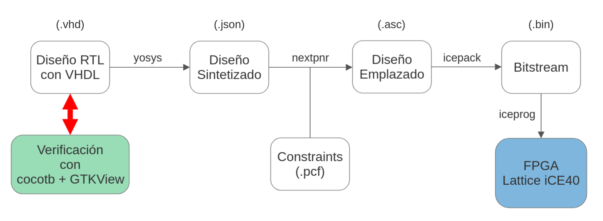

## Descripcion para instalar el toolchain de GHDL + ICEStorm (Yosys + nextpnr + iceprog) y plugin para usar VHDL con Yosys

#### Compilacion e instalacion GHDL, Yosys y ghdl-yosys-plugin

Primero instalar las dependencias necesarias para la compilacion de Yosis (aunque aca incluyo tambien un par de otras dependencias para mas adelante).
Es necesario un compilador C++ que soporte C++14 (Yosys pide C++11 pero nextpnr pide C++14. En yosys y nextpnr usan clang pero yo instalo gcc y g++):
 
```
sudo apt-get install build-essential gcc g++ bison flex \
	libreadline-dev gawk tcl-dev libffi-dev git \
	graphviz xdot pkg-config python3 python3-dev \
	libboost-all-dev zlib1g-dev cmake libeigen3-dev
```

Despues clonamos el repo de yosis:

```
git clone https://github.com/YosysHQ/yosys
```

Compilamos la configuracion segun el compilador de C++ que usamos (gcc en este caso), compilamos e instalamos yosys

```
cd yosys
make config-gcc
make
sudo make install
```

Ejecutamos un cmd de yosis para verificar que se instalo todo bien:

```
yosys --version
```

Ahora continuamos con GHDL. Hay que compilarlo de fuente para que nos de un header que necesita el plugin de ghdl-yosis-plugin.

Instalamos las dependencias:

```
sudo apt-get install gnat-12
```

Clonamos el repo:

```
git clone https://github.com/ghdl/ghdl
```

Configuramos e instalamos (en este caso, yo compilo GHDL con el backend de mcode. Es el mas facil y ya viene incluido sin hacer nada mas):

```
cd ghdl
mkdir build
cd build
../configure --prefix=/usr/local
make
sudo make install
```

Verificamos que se haya instalado bine el ghdl:

```
ghdl --version
```

Y finalmente vamos a descargar e instalar el plugin de ghdl para yosis:

```
git clone https://github.com/ghdl/ghdl-yosys-plugin/tree/master
cd ghdl-yosis-plugin
make
sudo make install
```

---

#### Compilado de toolchain de pnr y bajado a la placa

Para hacer el *place n route* usamos el proyecto hijo de Yosis, **nextpnr**.
Tambien tenemos que compilarlo de fuente:

```
git clone https://github.com/YosysHQ/nextpnr.git
cd nextpnr
cmake . -DARCH=ice40
make -j<nproc>
sudo make install
```

Reemplazar el valor de `<nproc>` por un numero aceptable de hilos (threads) que se quieran destinar del procesador a compilar esto (en particular yo use 8, asi que el comando quedo `make -j8`).

La otra parte que queda por compilar es el **iCEStorm**, que nos otorga los binarios para convertir el resultado del PNR en un bitstream y para cargarlo a la placa:

```
git clone https://github.com/cliffordwolf/icestorm.git icestorm
cd icestorm
make -j<nproc>
sudo make install

```

Nuevamente, reemplazar `<nproc>` segun lo explicado mas arriba.

---

#### Probando el toolchain

Para probar si funciona todo, vamos a compilar un archivo de testeo que va a hacer parpadear los leds de la placa de manera progresiva, al estilo de un contador binario.

Clonamos el repo de cores

```
git clone https://github.com/UTN-BA-Sats/cores.git
```

Buscamos el test de leds

```
cd cores/rtl/examples/ledtest/
ls
```

Deberian aparecer dos archivos, un `ledtest.vhd` y un `pinout.pcf`. El `.vhd` es la descripcion en hardware del vhdl mientras que el `.pcf` es el archivo de constraints que nos permite mapear nombres de signals logicas del vhd a las patitas de la FPGA.

Dentro de esa carpeta corremos:

```
yosys -m ghdl -p "ghdl ledtest.vhd -e ledtest; synth_ice40 -json ledtest.json -top ledtest"
nextpnr-ice40 --hx4k --package tq144 --pcf pinout.pcf --asc ledtest.asc --json ledtest.json
icepack ledtest.asc ledtest.bin
```

Enchufamos la placa EDU CIAA - FPGA y ejecutamos:

```
sudo iceprog ledtest.bin
```

Y si salio todo bien, deberiamos ver el contador binario en los leds de la FPGA!!

Para referencia, incluyo un grafico de como es el flujo de trabajo con este toolchain



